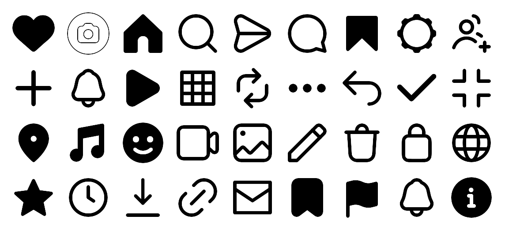

<div align="center">

# Instagram & Threads Icons

**The icon set behind Instagram and Threads — extracted, organised and searchable.**

[](#whats-inside)
[](#whats-inside)
[](#whats-inside)
[](LICENSE)
[](https://hongyinull.github.io/instagram-threads-icons/)



[**Browse all icons →**](https://hongyinull.github.io/instagram-threads-icons/)

</div>

---

Meta has never published the icon set used in Instagram and Threads. Their design system (IGDS) is internal, and the assets are scattered across web bundles and app resource archives, under names nobody can search.

This repository collects **2,055 icons** — **965 unique symbols** across outline and filled styles — and gives them consistent names, a machine-readable manifest, and a search page that works offline.

## Install

### JavaScript / TypeScript

Not published to the npm registry — install straight from GitHub:

```bash
npm install github:hongyinull/instagram-threads-icons
```

```js
import { find, url, sprite, filter } from 'instagram-threads-icons'

find('heart')            // → { name: 'heart', slug: 'heart-outline', path: '…', viewBox: '0 0 24 24' }
url('heart')             // → https://cdn.jsdelivr.net/gh/hongyinull/instagram-threads-icons@main/icons/…
sprite('heart')          // → …/sprites/instagram-web.svg#IGDSHeartPanoOutlineIcon
filter({ name: 'heart', style: 'filled' })   // → every filled heart, all sizes
```

Ships ESM, CommonJS and TypeScript types. The manifest is inlined, so no file
reads and no network calls.

### CDN — no install

Every icon is served by jsDelivr with the correct MIME type, so it works
directly in ``:

```html

```

> Use jsDelivr, not `raw.githubusercontent.com` — GitHub serves SVG as
> `text/plain`, which browsers refuse to render as an image.

### Sprites — one request for a whole collection

```html
<svg width="24" height="24" style="color: #e1306c">
  <use href="https://cdn.jsdelivr.net/gh/hongyinull/instagram-threads-icons@main/sprites/instagram-web.svg#IGDSHeartPanoOutlineIcon"/>
</svg>
```

| Sprite | Symbols | Size |
|---|---:|---:|
| `sprites/instagram-web.svg` | 322 | 213 KB |
| `sprites/threads-web.svg` | 226 | 313 KB |
| `sprites/instagram-vector.svg` | 24 | 59 KB |

### Download

```bash
git clone https://github.com/hongyinull/instagram-threads-icons.git
```

Or grab one file from the [browse page](https://hongyinull.github.io/instagram-threads-icons/) —
pick a copy format (CDN URL, `` tag, SVG markup, sprite reference) and click an icon.

## Styling

Every SVG uses `fill="currentColor"`, so icons inherit the text colour of their
container — no editing, no per-colour copies.

```css
.icon { width: 24px; height: 24px; color: #737373; }
.icon:hover { color: #e1306c; }
```

```jsx
// React — inline the SVG so it stays themeable
import { ReactComponent as Heart } from './icons/instagram/web/IGDSHeartPanoOutlineIcon.svg'

<Heart className="w-6 h-6 text-neutral-500" />
```

For iOS, the PNGs are `@3x`. Drop them into an Asset Catalog and Xcode reads the
scale from the filename.

## What's inside

| Collection | Path | Count | Format |
|---|---|---:|---|
| Instagram Web | `icons/instagram/web/` | 322 | SVG |
| Instagram iOS | `icons/instagram/ios/` | 1,483 | PNG `@3x` |
| Instagram Vector | `icons/instagram/vector/` | 24 | SVG |
| Threads Web | `icons/threads/web/` | 226 | SVG |

Icons that fail to render are kept in `_broken/` inside each collection rather than deleted, so nothing is silently lost.

Generated artefacts — `icons.json`, `sprites/` and `dist/` — are rebuilt by the
scripts in `tools/` and verified on every push by CI, so they can never drift
out of sync with the icon files.

### Naming

Files keep their original Meta names so you can trace them back to the source. The searchable, normalised names live in [`icons.json`](icons.json):

```json
{
  "name": "heart",
  "slug": "heart-outline-24",
  "file": "ig_icon_heart_outline_24@3x.png",
  "path": "icons/instagram/ios/ig_icon_heart_outline_24@3x.png",
  "platform": "instagram",
  "variant": "ios",
  "format": "png",
  "style": "outline",
  "size": 24
}
```

Original prefixes, for reference:

- `IGDS…` — Instagram Design System (web)
- `Barcelona…` — Threads (internal codename)
- `ig_icon_<name>_<style>_<size>` — Instagram iOS

Styles are `outline` and `filled`. Sizes are in points: 10, 12, 16, 18, 20, 24, 44.

### Query the manifest

```bash
# Every filled heart icon
jq '.icons[] | select(.name=="heart" and .style=="filled") | .path' icons.json

# Everything available at 24pt in SVG
jq -r '.icons[] | select(.size==24 and .format=="svg") | .slug' icons.json
```

## Browse

[**hongyinull.github.io/instagram-threads-icons**](https://hongyinull.github.io/instagram-threads-icons/) — search by name, filter by collection, click to copy a path. Dark mode included.

The same page works offline: open `index.html` directly, no server or build step needed.

## Contributing

Missing an icon, or found one that renders wrong? [Open an issue](https://github.com/hongyinull/instagram-threads-icons/issues) — include the icon name and where you saw it. See [CONTRIBUTING.md](CONTRIBUTING.md) for how the collection is updated.

## Licence

The tooling, manifest, organisation and documentation in this repository are MIT licensed — see [LICENSE](LICENSE).

**The icon artwork is not.** It is the property of Meta Platforms, Inc., extracted from publicly served Instagram and Threads web assets and the Instagram iOS app (build 436). This repository is an unofficial reference for design and research. It is not affiliated with, endorsed by, or sponsored by Meta.

Instagram, Threads, WhatsApp, Meta and their logos are trademarks of Meta Platforms, Inc. Evaluate your own risk before using these assets commercially, or obtain permission through [Meta's brand guidelines](https://about.meta.com/brand/resources/). Takedown requests will be honoured — [open an issue](https://github.com/hongyinull/instagram-threads-icons/issues) or email the maintainer.
